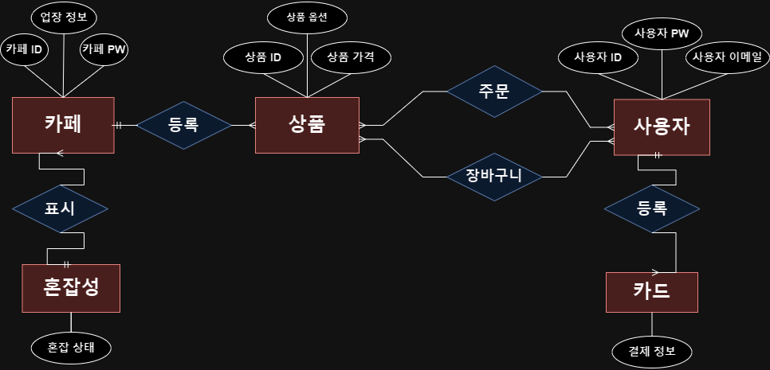
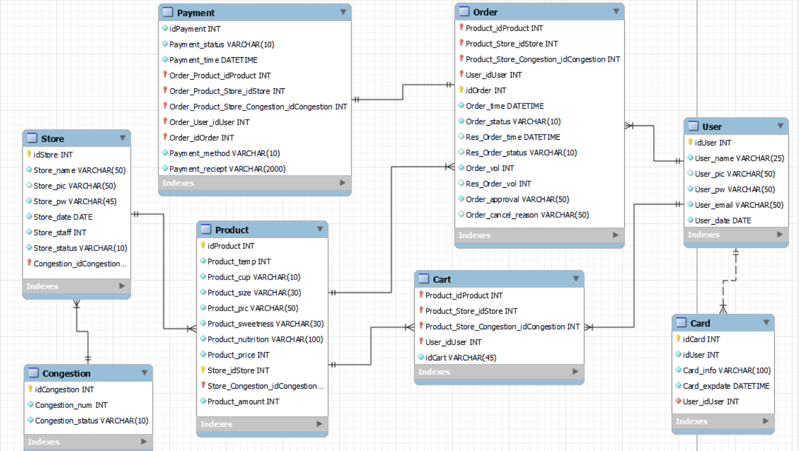

<h1 align="center">DevCafe ☕️</h1>

<div align="center"> 
 
</div>


> [플레이 데이터] 한화시스템 BEYOND SW캠프 / DEVCafe


🎬[Demo 시연영상]().   
📃[프로젝트 회고록](블로그주소) 

<br>

## ✨ 프로젝트 소개

```sh
현재 많은 카페들이 온라인 주문 시스템을 활용하여 주문의 편의성을 높혀주는 모습을 보여주고 있습니다.

이렇게 상용화 되어 있는 온라인 주문 시스템에 편리함을 느끼는 사용자들이 많이 있지만
 그 편리함 속에서도 작은 불편함들이 존재한다고 느끼는 사용자들이 있다는것을 파악하였고  

그러한 사용자들이 느끼는 불편함이 어떤 것인지 파악해 더 많은 사용자가 더욱 편하게 이용할 수 있는
온라인 주문 시스템을 제공해 보고자 이러한 프로젝트를 진행하게 되었습니다.
```

## 📌 프로젝트 목표

```sh
저희 프로젝트의 주요 개발 목표로 주문시 매장의 혼잡도를 알 수 없는 점,
 주문취소를 할 수 없는 점 등을 해소하는 것을 목표로 개발하였습니다.  

개발 내용의 설명으로 시간대 별 혼잡도를 나타내주는 프로그램을 추가하여
 주문 시 취소가 어려운 사이렌 오더의 단점을 최소화 하고  

기존에 불가했던 예약 주문 시스템을 도입하여
 편리하게 주문할 수 있는 페이지를 만들어 기존의 사이렌 오더와 차별화를 시도하였습니다.
```
## 📃 프로젝트 시나리오
```sh
1. 사용자 요구사항
 1) 주문 기능 
  음료 및 음식 선택: 사용자는 메뉴에서 음료 및 음식을 선택하고 주문할 수 있어야 합니다.
  옵션 선택: 주문 시 온도, 당도, 크기 등의 옵션을 선택할 수 있어야 합니다.

 2) 계정 관리 
  회원가입 및 로그인: 사용자는 개인 계정을 만들고 로그인하여 주문 서비스를 이용할 수 있어야 합니다.
  주문 이력 확인: 로그인한 사용자에게는 주문 이력을 확인할 수 있는 기능이 있어야 합니다.


2. 카페 운영자 요구사항
 1) 주문 관리 
  주문 목록 확인: 카페 운영자는 주문 목록을 확인하고 주문 상태를 업데이트할 수 있어야 합니다.
  알림 전송: 주문이 준비되면 알림을 전송하고, 완료된 주문에 대한 통계를 확인할 수 있어야 합니다.

 2) 매장 및 메뉴 관리 
  메뉴 관리: 카페 운영자는 메뉴 항목을 추가, 수정, 삭제할 수 있어야 합니다.
  매장 정보 관리: 각 매장에 대한 정보(위치, 운영 시간 등)를 관리할 수 있어야 합니다.


3. 시스템 요구사항
 1) 사용자 관리
  사용자 정보 저장: 사용자의 정보를 저장하고 관리하는 기능이 필요합니다.
  사용자의 ID, 이름, 이메일 등을 포함할 수 있습니다.

 2) 알림 관리 
  알림 저장: 알림 내용, 전송 대상 사용자, 알림 생성 시간 등을 저장할 수 있습니다.
  알림의 상태 관리: 주문이 수락 되었는지 취소 되었는지와 같은 상태를 관리하는 기능이 필요합니다.

 
 3) 알림 전송
  푸시 알림: 모바일 앱 또는 웹 앱을 대상으로 하는 경우, 푸시 알림을 전송하는 기능이 필요합니다.
  이메일 또는 기타 전송 수단: 푸시 외에도 이메일이나 SMS 등 다양한 전송 수단을 활용하여 알림을
  사용자에게 전송하는 기능이 필요합니다.

4. 결제 시스템
 1) 카드 등록 
  사용자는 카드 정보를 시스템에 등록할 수 있어야 합니다.
  등록된 카드는 안전하게 저장되고, 중요 정보는 암호화되어야 합니다.

 2) 모바일 결제
  사용자는 모바일 결제 서비스를 통해 주문을 결제할 수 있어야 합니다.
  모바일 결제 시스템은 편리하고 안전한 방법으로 동작해야 합니다.

 3) 전자 영수증 
  결제가 완료되면 사용자에게 전자 영수증을 제공해야 합니다.
  전자 영수증은 안전한 방식으로 전송되어야 하며, 사용자가 언제든 확인할 수 있어야 합니다.  


 4) 알림 서비스 
 사용자가 주문한 상품의 상태가 변경될 때(주문 접수, 제조 중, 완료 등) 알림이 전송되어야 합니다.  
 결제가 승인되거나 거절되었을 때, 결제 취소 및 환불 처리와 같은 결제 상태 변경에 대한
 알림이 전송되어야 합니다. 또한, 알림은 사용자에게 효과적으로 전달되어야 합니다.


5. 주문 취소 시스템
 1) 주문이 승인된 이후에는 취소가 불가능해야 하고, 주문 승인과 연관성을 가져야 합니다.

 2) 주문 취소 시 알림 서비스를 통해 사용자에게 알림이 전송되어야 합니다.

 3) 주문 취소 시 결제 시스템에서 해당 주문에 대한 결제 취소가 발생해야 합니다.


6. 결제 시스템
 1) 안전하고 신뢰성 있는 결제 시스템을 도입하여 사용자의 결제를 처리해야 합니다.

7. 혼잡도 요구사항
 1) 혼잡도 확인: 매장 선택 페이지에서 매장의 혼잡도가 표시되어야 합니다.

 2) 실시간 데이터 수집: 혼잡도를 정확하게 표시하기 위해서는
    매장 내의 주문서와 직원 수 현황을 실시간으로 수집해야 합니다.

 3) 혼잡도 계산: 매장 크기, 매장 내 직원 수, 미완된 주문수 등을 고려하여
    매장의 용량을 설정하고 이를 기반으로 혼잡도를 계산합니다.

 4) 혼잡도 표시: 실시간 매장 상황에 따라 혼잡도를 시각적으로 나타내는 기능이 필요합니다.

```

## 🔍 Overview

### 1. Relation Schema

<center>
    
</center>


<br>

### 2. ERD

<center>
    
</center>

<br>


## System Architecture

<center>
    
</center>
대용량 트래픽을 고려한 서버 이중화

<br>


## 🤼‍♂️팀원

팀장 : 김도현  
팀원 : 김지은, 김주연, 김준엽
